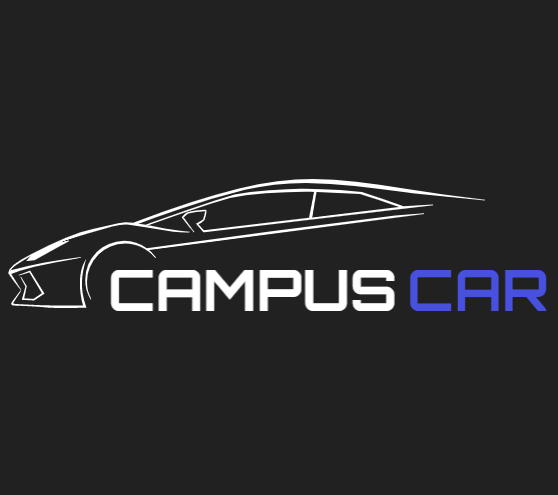

 <div align="center">


# CampusCar

[](https://flutter.dev/docs)
[](https://firebase.google.com/docs)
[](https://code.visualstudio.com/ "Visual Studio Code")

</div>

Table of contents
-----------------

* [Introduction](#introduction)
* [Features](#Features)
* [Demo](#Demo)
* [Installation](#installation)
* [Contributing](#contributing)
* [License](#license)
* [Contributors](#contributors)


## Introduction

Campus Car


## Features

* User
    * License Plate Detection from car image.
    * Check for vehicles access inside the campus.
    * Register new vehicles entering the campus with temporary permit (1 day permit).
    * Live vehicles feature. (See vehicles coming at the gate with its details in real time with no user interaction required).

* Admin
    * Authentication.
    * Admin Dashboard with all required statistics and graphs.
    * Keep track of all registered vehicles and their location in/out campus.
    * Update Expiry date of vehicles access in campus.
    * Keep track of logs of all vehicles.
    * Download/Export Logs/Vehicles to excel sheet.
    * Add new vehicle.
    * Send reminder SMS to user of their access period's expiry.
    * Notify user through SMS on any change in expiry date of their vehicle's access. 


## Demo

<div align="center">

</div>

## Installation

Before starting with installation you would require server for license plate recognition.
For that please follow the steps in the README file [here](https://github.com/shahshubh/CampusCar-Server) and then come back.

Once the server is up and running copy the ngrok api url you get after running it and follow below steps.

1. Clone this repository `git clone https://github.com/shahshubh/CampusCar.git`.
2. Change directory `cd CampusCar`.
3. Go to /lib/screens/user/home/home_screen.dart file and on Line 70 change it to
    ```dart
    var endpoint = apiUrl != null ? apiUrl : "your-ngrok-api-url-string-that-you-copied-above";
    ```
3. Create a new [firebase project](https://firebase.google.com/)
4. Go to project settings and download **google-services.json** file.
5. Copy this file and paste it inside /CampusCar/android/app/ folder.
6. Next create .env file in root folder and add
    ```dart
    ALPR_TOKEN=your-alpr-token
    ```
    You can get your token from [here](https://platerecognizer.com/)
7. Run `flutter pub get`.
8. Finally run `flutter run`.


## Contributing
1. Fork it (https://github.com/shahshubh/CampusCar/fork)
2. Create your feature branch (git checkout -b feature/fooBar)
3. Commit your changes (git commit -am 'Add some fooBar')
4. Push to the branch (git push origin feature/fooBar)
5. Create a new Pull Request

## License
[](https://github.com/shahshubh/CampusCar/blob/master/LICENSE)


## Stargazers
[](https://github.com/shahshubh/CampusCar/stargazers)


<br/>
<p align="center"><a href="https://github.com/shahshubh/CampusCar#"></a></p>